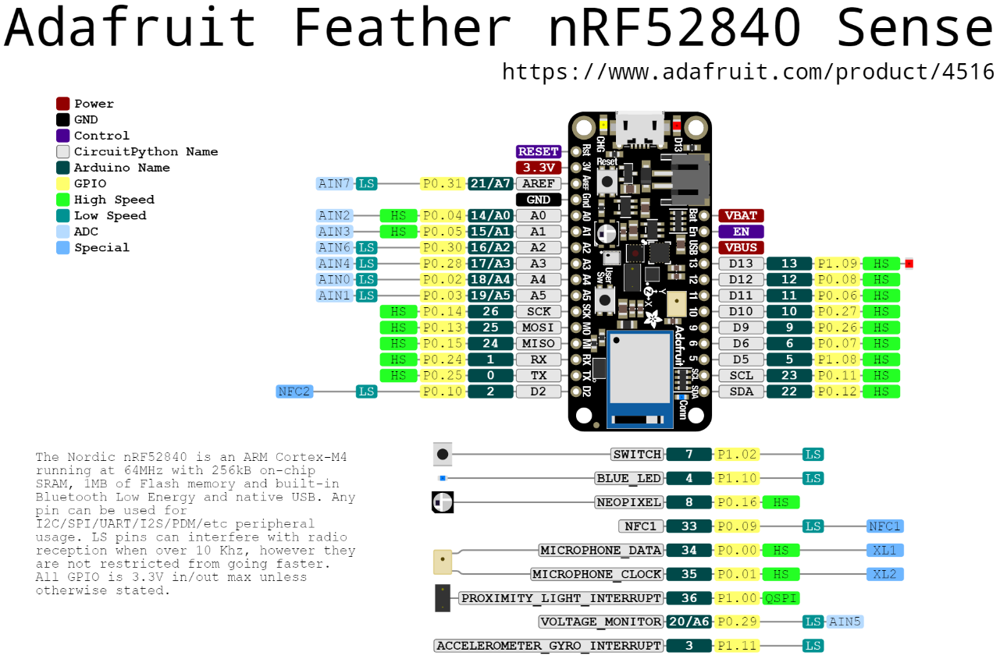

= Programming the Adafruit Feather Bluefruit Sense with CircuitPython
Programming Connected Devices (CPS2 only)
:homepage: http://ci.mines-stetienne.fr/cps2/course/pcd/
:toc: left

In this lab you will set up your working environment in Visual Studio Code for developing a CircuitPython project for your two nRF52840 microcontrollers, and you will start experimenting with CircuitPython and IoT technologies.

NOTE: This lab is only for CPS2 students, for their course on Programming Connected Devices

== Introduction to the Adafruit Feather Bluefruit Sense

NOTE: deadline for the labs is 15/01.

The nRF52 Series SoCs was the second series of short range wireless SoCs from Nordic Semiconductor. The nRF52840 SoC is very successful and exists in millions of popular consumer devices in the world today, among them wireless mice, keyboards and audio devices. The popularity of Nordic's nRF52 series allows for Nordic Semiconductor to maintain a 40% worldwide market share in the Bluetooth LE segment. (source: Wikipedia)

The briefcase contains two link:docs/adafruit-feather-sense.pdf[Adafruit Feather Bluefruit Sense], that contain the link:docs/nRF52840_PS_v1.7.pdf[nRF52840] Soc, which is well known for its Bluetooth 5 + IEEE 802.15.4-2006, 2.4 GHz transceiver.

.The Adafruit Feather Bluefruit Sense pinouts

== Start working with CircuitPython on the nRF52840

.Follow these steps
. install the CircuitPython extension for Visual Studio Code
. follow the steps at https://learn.adafruit.com/adafruit-feather-sense/circuitpython-on-feather-sense 
. open the usb directory inside visual studio code
. in the `View - Command Palette` menu, select the board using command `> CircuitPython: choose CircuitPython Board` and select `Adafruit Industries LLC: Feather Bluefruit Sense`
. read link:https://learn.adafruit.com/adafruit-feather-sense/circuitpython-pins-and-modules[the guide on CircuitPython Pins and Modules]
. if you feel you need it, go through the link:https://learn.adafruit.com/circuitpython-essentials[guide on CircuitPython Essentials] 

== Sensors and actuators

NOTE: .5 points for the questions / 20

The Adafruit Feather Bluefruit Sense embeds a set of environmental and motion sensors:

* ST Micro series 9-DoF motion - link:docs/LSM6DS33.pdf[LSM6DS33 Accel/Gyro] + link:docs/lis3mdl.pdf[LIS3MDL magnetometer]
* link:docs/Avago-APDS-9960-datasheet.pdf[APDS9960 Proximity, Light, Color, and Gesture Sensor]
* link:docs/MP34DT01-M.pdf[MP34DT01-M] PDM Microphone sound sensor
* link:docs/Sensirion_Humidity_Sensors_SHT3x_Datasheet_digital-971521.pdf[SHT Humidity sensor]
* link:docs/BST-BMP280-DS001-11.pdf[BMP280 temperature and barometric pressure/altitude sensor]

.Answer the following questions
1. For each sensor, state what is its digital interface to the main nRF52840 SoC.

2. How is the microphone data transmitted?

_(edit this file and write your answers here)_

Install any required library using the command `> CircuitPython: Show available libraries`, then search for a library, then press enter. the libraries should be downloaded in the lib folder.

NOTE: the sources of these libraries can be found link:https://github.com/adafruit/Adafruit_CircuitPython_Bundle/tree/main/libraries/drivers[on github]. In the repository of each library, for example for the link:https://github.com/adafruit/Adafruit_CircuitPython_APDS9960[APDS9960 Proximity, Light, RGB, and Gesture Sensor], you will find the source code, the sources of the documentation, and ready-to-run examples. The documentation of a library is published at `https://docs.circuitpython.org/projects/<<name_of_the_library>>/en/latest/api.html`. For example: https://docs.circuitpython.org/projects/apds9960/en/latest/api.html for the APDS9960 Proximity, Light, RGB, and Gesture Sensor ; https://docs.circuitpython.org/projects/bmp280/en/latest/api.html for the BMP280 Temperature and Barometric Pressure sensor .

.Do the following
1. test the link:https://learn.adafruit.com/adafruit-feather-sense/circuitpython-sense-demo[CircuitPython Sense Demo]
2. Check out some of the examples from the GitHub libraries.

== The 32x128 OLED Screen 

NOTE: 2 pts for the initial program, .75 points for the questions , +1 point for a version of the program that uses asyncio / 20

Every briefcase contains a link:https://learn.adafruit.com/adafruit-oled-featherwing/[Adafruit FeatherWing 128x32 OLED display], which contains a link:docs/UG-2832HSWEG02.pdf[128x32 SSD1306 OLED] controllable using the common link:docs/SSD1306.pdf[SSD1306 I2C Driver], and three buttons A, B, C. You need to check out the following guides for this exercise:

Look at the link:https://learn.adafruit.com/adafruit-oled-featherwing/[guide], the link:https://docs.circuitpython.org/projects/displayio_ssd1306/en/latest/[docs], and the link:https://github.com/adafruit/Adafruit_CircuitPython_DisplayIO_SSD1306/[examples in the source repository]

.Answer these questions below 
. What does I2C stands for?
. To what pins are buttons A, B, C, connected?
. What is the default I2C address for the I2C peripheral? Check from the link:docs/SSD1306.pdf[official documentation] section 8.1.5 a), with "SA0"=0. and "R/W#"=0

_(edit this file and write your answers here)_

.Do the following
. When button A is pressed, switch from: (1) print the output of the proximity sensor on the screen ; (2) print the temperature and humidity.
. Update the value and the display every 250 ms seconds.
. When button B is pressed, invert the colours. 

_(organise your repository to save the code that you sucessfully tested)_

The initial response to the question in in repository `cps2/response_oled` . it works!!!

The program with asyncio is in repository `cps2/response_oled_asyncio` . it works!!!

== Multitasking in CircuitPython

.Do the following
Follow link:https://learn.adafruit.com/cooperative-multitasking-in-circuitpython-with-asyncio[this guide] to learn how to do cooperative multitasking in CircuitPython, using the `asyncio` library and the `async` and `await` language keywords, and the two native modules, `countio` and `keypad`, that can track your pin state changes in the background.

_(make sure you use what you learned wisely in any subsequent code development)_

== BLE (Bluetooth Low Energy)

NOTE: 2 pts for the program, +1 point if you use asyncio wisely, 1 point for the questions / 20

The slides of link:https://ci.mines-stetienne.fr/cps2/course/pcd/#_part_7_low_power_wireless_personal_area_networks_lowpan[Lecture 7 LoWPAN] may be useful, together with the following Bluetooth specification documents:

* link:docs/Mesh%20Model%201.0.1.pdf[Bluetooth Mesh Model 1.0.1 Specification]: defines models (along with their required states and messages) that are used to perform basic functionality on the nodes in a mesh network beyond the foundation models defined in the Bluetooth Mesh Profile specification [2]. This specification includes generic models defining functionality that is standard across device types, and models, such as lighting control, sensors, and time and scenes, to support key mesh scenarios.
* link:docs/Mesh%20Profile%201.0.1.pdf[Bluetooth Mesh Profile 1.0.1 Specification]: defines fundamental requirements to enable an interoperable mesh networking solution for Bluetooth low energy wireless technology.
* link:docs/Mesh%20Device%20Properties%202.pdf[Bluetooth Mesh Device Properties 2 Specification]: contains definitions of device properties that are required by the Bluetooth Mesh Profile and Bluetooth Mesh Model specifications.
* link:docs/Assigned-Numbers-2022-11-28.pdf[Bluetooth Assigned Numbers]: a regularly updated document listing assigned numbers, codes, and identifiers in the Bluetooth specifications.

Browse these specifications and the link:https://github.com/adafruit/Adafruit_CircuitPython_BLE_Heart_Rate/blob/main/adafruit_ble_heart_rate.py[Heart Rate Service implementation example]. Answer the following questions.

.Answer these questions below 
. In what document(s) can you find the specification of the `org.bluetooth.service.heart_rate` service?
. What is the format of the `org.bluetooth.characteristic.temperature` characteristic according to the specification?
. How are the appearance UUIDs used by BLE clients such as your phone?
. Find appropriate BLE services and characteristics you may use in your project

Answers
1 The specifications of org.bluetooth.service.heart_rate service can be found in the Bluetooth Assigned Numbers Document.

2 The format of the `org.bluetooth.characteristic.temperature` characteristic according to the specification 
 The Temperature Measurement characteristic is a variable length structure containing a Flags field, a
 Temperature Measurement Value field and, based upon the contents of the Flags field, optionally a Time
 Stamp field and/or a Temperature Type field.

3 The Appearance UUIDs in Bluetooth Low Energy are standardised codes used to descriibe the physical appearance of a BLE device. These UUIDs are defined in the Bluetooth SIG specifications to help BLE devices like Smartphones understand the type and form factor a peripherial device they are trying to connect to. When a BLE such as a smartphone device scans for nearby BLE devices or peripherials it can recieve advertisement packets from these devices. These packets usually contains information like the device name, service offered and the appearance UUIDs. The appearance UUIDs acts as a shorthand way for the devices to the indentify the physical appearance or category of the BLE device. The appearance UUIDs can describe if a device looks like a heart rate sensor or thermometer,a keyboard, a mouse and etc. The device upon recieving these advertisement packets containing the appearance UUIDs can use this information to 
Display Device Type: show the user the type or category of nearby BLE devices.
Filter Devices: Allow user to filter or search for specific types of devices based on their appearance
Improve User Experience: help in presenting a more understandable and organised list of devices to the user.
if your phone is scanning for BLE devices and detects a heart rate monitor, it might display an appropriate icon or label indicating that it has found a heart rate sensor, thanks to the appearance UUID associated with that device.

Look at the link:https://learn.adafruit.com/adafruit-feather-sense/getting-started-with-ble-and-circuitpython[guide], the link:https://docs.circuitpython.org/projects/ble/en/latest/[docs], and the link:https://github.com/adafruit/Adafruit_CircuitPython_BLE/tree/main[examples in the source repository]

.Do the following
. Experiment with bluetooth and organize your code in folder `cps2/ble`.

== LoRa (Long Range)

NOTE: 2 pts for the program, +1 point if you use asyncio wisely, .75 points for the questions / 20

The slides of link:https://ci.mines-stetienne.fr/cps2/course/pcd/#_part_8_low_power_wide_area_networks_lpwan[Lecture 7 LPWAN] may be useful

Look at the link:https://learn.adafruit.com/adafruit-rfm69hcw-and-rfm96-rfm95-rfm98-lora-packet-padio-breakouts/circuitpython-for-rfm9x-lora[guide], the link:https://docs.circuitpython.org/projects/rfm9x/en/latest/[docs], and the link:https://github.com/adafruit/Adafruit_CircuitPython_RFM9x[examples in the source repository]

.Answer the following questions
. what frequency must we use use?
. what kind of antenna do we use?
. what is crc?
Answers
1 For Europe, the Authorized frequency range for LoRa communication is typically 868 MHz. 

3 crc (Cyclic Redundancy Check):

    CRC is a type of error-checking code used to detect accidental changes to raw data. In the context of communication protocols like LoRa, CRC helps ensure the integrity of the transmitted data. LoRa modules often use CRC to verify that the received data is not corrupted during transmission.

.Do the following
. Try to break last year's record of longest distance communication, using the different parameters.

== Integrate with the Web/Mobile/Embedded programming project 

NOTE: 5 pts / 20: 2 points for a good integration, 2 points for the code, 1 point for the README.md 

If applicable, you should use what you learned in this course to augment your Web/Mobile/Embedded project with one or two of the Adafruit Bluefruit Sense boards programmed using CircuitPython.

Write here the location of the CircuitPython project in your repository, and describe the main purpose and functionnalities of your project in its `README.md` file.

IMPORTANT: You may totally use snippets from existing samples, answers to questions on stackoverflow, or output from generative AIs. But whenever applicable, do **cite your sources**

I will participate to the demonstration session in January.

== Exam (5 pts / 20)

There will be an exam on 10/01 9:00-10:30, on the content of lectures 2, 5, 6, 7, 8, and some knowledge you obtained from doing the labs.
